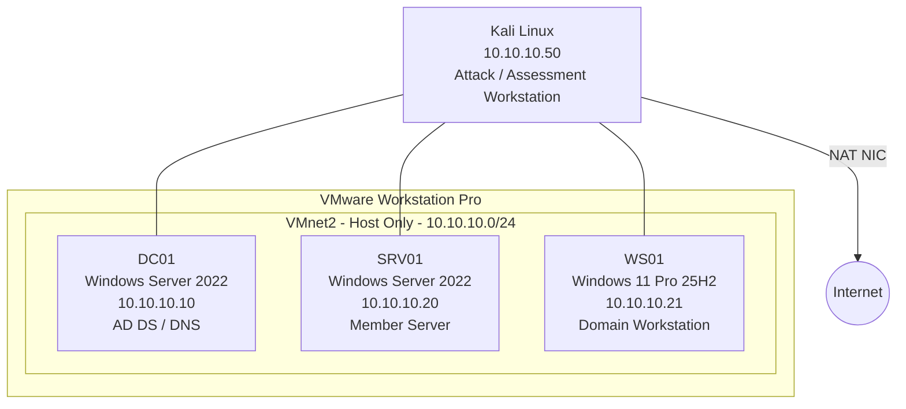
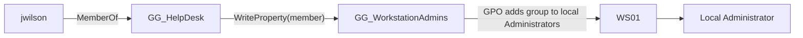
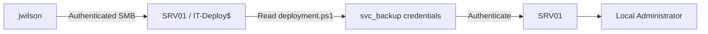

# HZN Vulnerable Active Directory Lab

A reproducible Active Directory penetration-testing homelab built with VMware Workstation Pro, Windows Server 2022, Windows 11, and Kali Linux.

The project teaches both sides of Active Directory security: how a small business-style domain is built, which administrative choices create attack paths, how those paths are discovered with offensive tooling, and how to reset the environment for repeated testing.

> **Authorized lab use only.** Use the techniques in this repository only in isolated labs or against systems you own or have explicit authorization to test.

## Table of Contents

- [Prerequisites](#prerequisites)
- [Architecture](#architecture)
- [Learning Objectives](#learning-objectives)
- [What the Project Covers](#what-the-project-covers)
- [Vulnerability Scenarios](#vulnerability-scenarios)
- [Attack Paths](#attack-paths)
- [Build Order](#build-order)
- [Manual vs Automated Build](#manual-vs-automated-build)
- [Suggested Snapshots](#suggested-snapshots)
- [Lab Credentials](#lab-credentials)
- [Security Notes](#security-notes)
- [Future Expansion](#future-expansion)
- [License](#license)
- [Disclaimer](#disclaimer)

## Prerequisites

This project was built and validated using the following software:

### Virtualization

- VMware Workstation Pro
- Sufficient host resources to run Kali Linux and three Windows VMs simultaneously

### Installation Media

- Windows Server 2022 ISO
- Windows 11 Pro 25H2 ISO
- Kali Linux VMware image

The walkthroughs and screenshots in this project assume **Windows Server 2022** for DC01 and SRV01 and **Windows 11 Pro 25H2** for WS01.

Other supported Windows Server and Windows 11 releases may also work, but configuration steps, Group Policy behavior, security defaults, firewall rules, and tool output may differ. If you want to reproduce the lab as documented, use the versions listed above.

### Recommended Host Resources

A host with at least the following is recommended:

- 16 GB RAM minimum; 32 GB preferred
- 4+ CPU cores
- Approximately 150-200 GB of available storage
- Hardware virtualization enabled in BIOS/UEFI

Resource allocation can be adjusted based on available hardware.

### Downloads

Have the required installation media downloaded before beginning the build. ISO files and virtual-machine disks should **not** be committed to this repository.

## Architecture



**Domain:** `hznlab.local`  
**NetBIOS:** `HZNLAB`

| Host | OS | IP | Role |
|---|---|---|---|
| DC01 | Windows Server 2022 | `10.10.10.10` | AD DS / DNS |
| SRV01 | Windows Server 2022 | `10.10.10.20` | Member server |
| WS01 | Windows 11 Pro 25H2 | `10.10.10.21` | Domain workstation |
| Kali | Kali Linux | `10.10.10.50` | Attack / assessment workstation |

## Learning Objectives

This lab is designed to teach more than individual exploitation techniques. By building and testing the environment from scratch, you will practice the full lifecycle of an internal Active Directory penetration test.

After completing the lab, you should be able to:

- Design and deploy an isolated Active Directory testing environment.
- Configure a Windows Server domain controller, DNS, organizational units, users, groups, and service accounts.
- Join Windows workstations and member servers to an Active Directory domain.
- Understand how common administrative decisions create exploitable attack paths.
- Perform authenticated SMB, LDAP, Kerberos, and Active Directory enumeration from Kali Linux.
- Identify Kerberoastable and AS-REP roastable accounts.
- Analyze Active Directory relationships and attack paths with BloodHound.
- Identify and validate dangerous Active Directory ACL relationships.
- Discover exposed credentials in accessible network shares.
- Validate the impact of compromised credentials across multiple domain systems.
- Distinguish between successful authentication and administrative access.
- Document technical findings and remediation guidance.
- Reset the environment for repeatable testing, demonstrations, and proof-of-concept work.

The manual build path is recommended for first-time users because understanding **why** a configuration is vulnerable is more valuable than simply reproducing an exploit.

## What the Project Covers

- VMware host-only range networking
- Kali dual-homed networking and split DNS
- Windows Server 2022 domain-controller deployment
- Windows 11 domain joining
- Windows Server 2022 member-server deployment
- AD OUs, groups, users, service accounts, and Group Policy
- BloodHound Community Edition
- Kairos Report Engine
- Kerberoasting
- AS-REP roasting
- Active Directory ACL abuse
- Credential exposure via SMB
- Local administrator escalation
- Snapshots and reset procedures
- Common troubleshooting issues encountered during real lab construction

## Vulnerability Scenarios

### 1. Kerberoasting

`svc_sql` has an MSSQL service principal name, a deliberately weak lab password, and local administrator access to SRV01.

See: [vulnerabilities/01-kerberoasting.md](vulnerabilities/01-kerberoasting.md)

### 2. AS-REP Roasting

`legacy_app` is configured with Kerberos pre-authentication disabled and a deliberately weak lab password.

See: [vulnerabilities/02-asrep-roasting.md](vulnerabilities/02-asrep-roasting.md)

### 3. Active Directory ACL Abuse

`GG_HelpDesk` can modify membership of `GG_WorkstationAdmins`. Group Policy makes `GG_WorkstationAdmins` a local administrator on WS01.

See: [vulnerabilities/03-ad-acl-abuse.md](vulnerabilities/03-ad-acl-abuse.md)

### 4. Credential Exposure

An authenticated domain user can read a hidden deployment share on SRV01 containing plaintext `svc_backup` credentials. That account is a local administrator on SRV01.

See: [vulnerabilities/04-credential-exposure.md](vulnerabilities/04-credential-exposure.md)

## Attack Paths

The initial release contains four deliberately vulnerable scenarios representing common findings during internal Active Directory penetration tests.

| Scenario | Starting Position | Weakness | Target | Result |
|---|---|---|---|---|
| Kerberoasting | Domain user | Weak password on SPN-enabled `svc_sql` | `svc_sql` | Credential compromise and administrative access to SRV01 |
| AS-REP Roasting | Network access / known username | Kerberos pre-authentication disabled on `legacy_app` | `legacy_app` | Offline password attack against the account |
| AD ACL Abuse | `jwilson` / `GG_HelpDesk` | Delegated ability to modify `GG_WorkstationAdmins` membership | WS01 | Local administrator access to WS01 |
| SMB Credential Exposure | `jwilson` | Readable deployment share containing plaintext credentials | `svc_backup` | Local administrator access to SRV01 |

### ACL Abuse Path



### Credential Exposure Path



Each scenario has a dedicated walkthrough under [`vulnerabilities/`](vulnerabilities/) covering configuration, validation, remediation, and reset procedures.

## Build Order

Follow the guides in order:

1. [VMware networking](docs/01-vmware-networking.md)
2. [Kali setup](docs/02-kali-setup.md)
3. [DC01 build](docs/03-dc01-build.md)
4. [Active Directory setup](docs/04-active-directory-setup.md)
5. [WS01 build](docs/05-ws01-build.md)
6. [SRV01 build](docs/06-srv01-build.md)
7. [BloodHound](docs/07-bloodhound.md)
8. [Kairos Report Engine](docs/08-kairos.md)
9. [Snapshots and reset](docs/09-snapshots-and-reset.md)
10. [Troubleshooting](docs/troubleshooting.md)

Then work through the individual scenarios under [`vulnerabilities/`](vulnerabilities/).

## Manual vs Automated Build

### Manual Track

Recommended for a first build. Follow the documentation and create the domain, objects, permissions, and vulnerable conditions yourself.

This approach makes the relationship explicit:

```text
Configuration -> Exposure -> Enumeration -> Exploitation -> Impact
```

### Automated Track

Once you understand the environment, use the PowerShell scripts under `scripts/powershell/` for faster repeat builds.

Suggested order:

```powershell
.\01-create-ous.ps1
.\02-create-groups.ps1
.\03-create-users.ps1
.\04-create-service-accounts.ps1
.\05-enable-vulnerabilities.ps1
```

Use the automated track only on the isolated lab domain.

## Suggested Snapshots

### DC01

```text
DC01-01 - Clean Server 2022
DC01-02 - Clean AD DS
DC01-03 - Populated Clean Domain
DC01-04 - Vulnerable Domain
```

### WS01

```text
WS01-01 - Clean Domain Joined
WS01-02 - Populated Clean Domain
WS01-03 - Vulnerable Workstation
```

### SRV01

```text
SRV01-01 - Clean Domain Joined
SRV01-02 - Vulnerable Member Server
```

See [docs/09-snapshots-and-reset.md](docs/09-snapshots-and-reset.md).

## Lab Credentials

The repository uses deliberately weak credentials for training.

Examples include:

```text
HznLab2026!
Summer2026!
Legacy2024!
Backup2025!
```

These credentials must **never** be reused outside this disposable lab.

## Security Notes

- Do not bridge deliberately vulnerable Windows machines to your home or production LAN.
- Keep VMnet2 host-only.
- Kali may be dual-homed, but the vulnerable Windows systems should remain isolated.
- Do not expose BloodHound, Kairos, SMB, LDAP, WinRM, or other lab services to the public Internet.
- Use snapshots before major configuration changes.
- Never commit real credentials, client assessment data, BloodHound exports from client environments, private keys, reports, VM disks, or ISO files to this repository.
- Snapshots are rollback points, not backups.

## Future Expansion

Potential future scenarios:

- AD CS / certificate-template abuse
- GPO delegation abuse
- WriteDACL / WriteOwner chains
- Resource-based constrained delegation
- Constrained / unconstrained delegation
- LAPS-related scenarios
- MSSQL
- IIS
- NTLM relay scenarios
- Second domain and trust relationships
- Linux member servers
- Detection engineering and Windows event logging
- Remediation and retest exercises

## License

MIT. See [LICENSE](LICENSE).

## Disclaimer

All systems, credentials, names, domains, addresses, organizations, and vulnerabilities in this project are fictitious and intended solely for isolated education and authorized security testing.

Do not use the techniques in this repository against systems you do not own or have explicit authorization to test.
